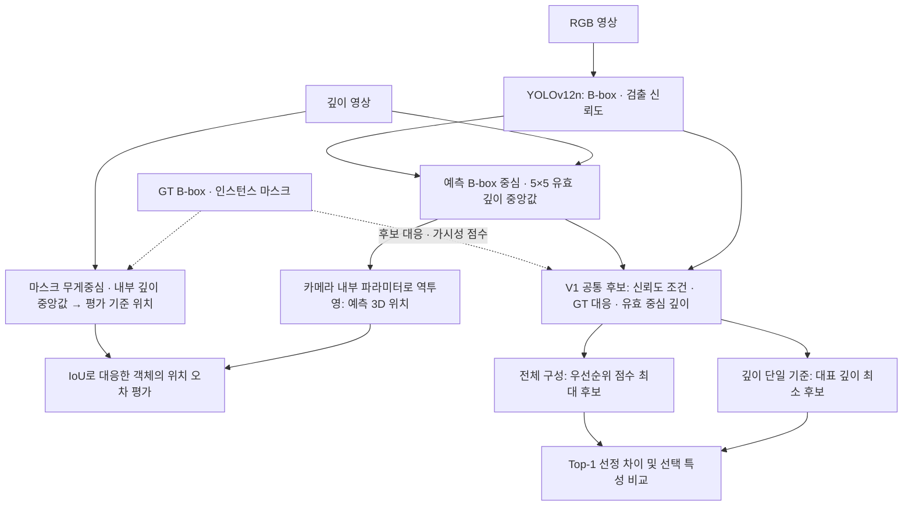
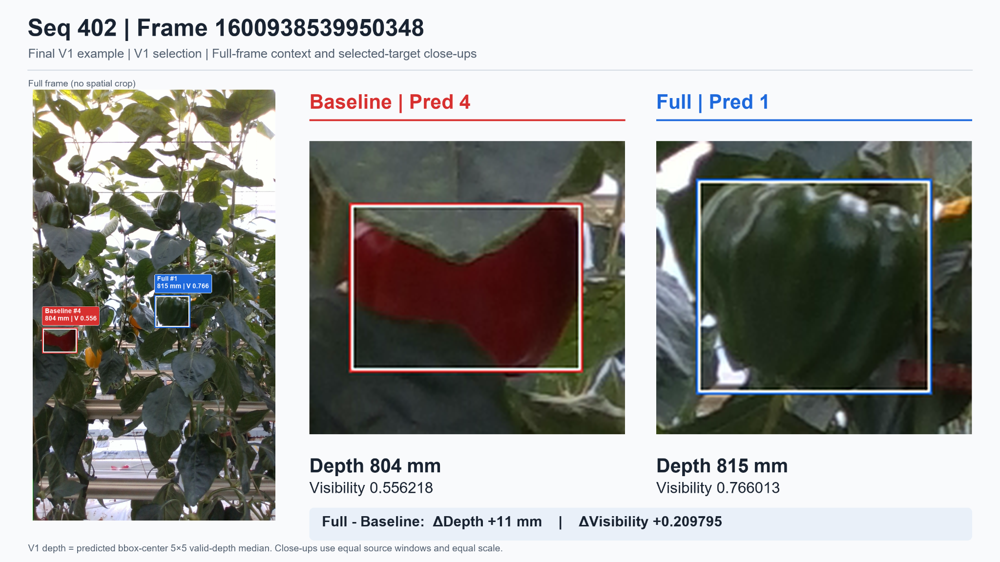
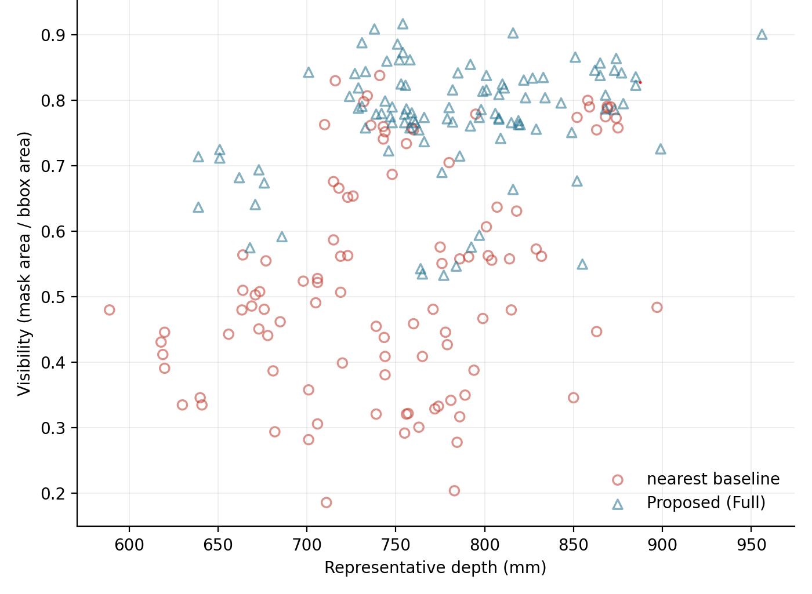
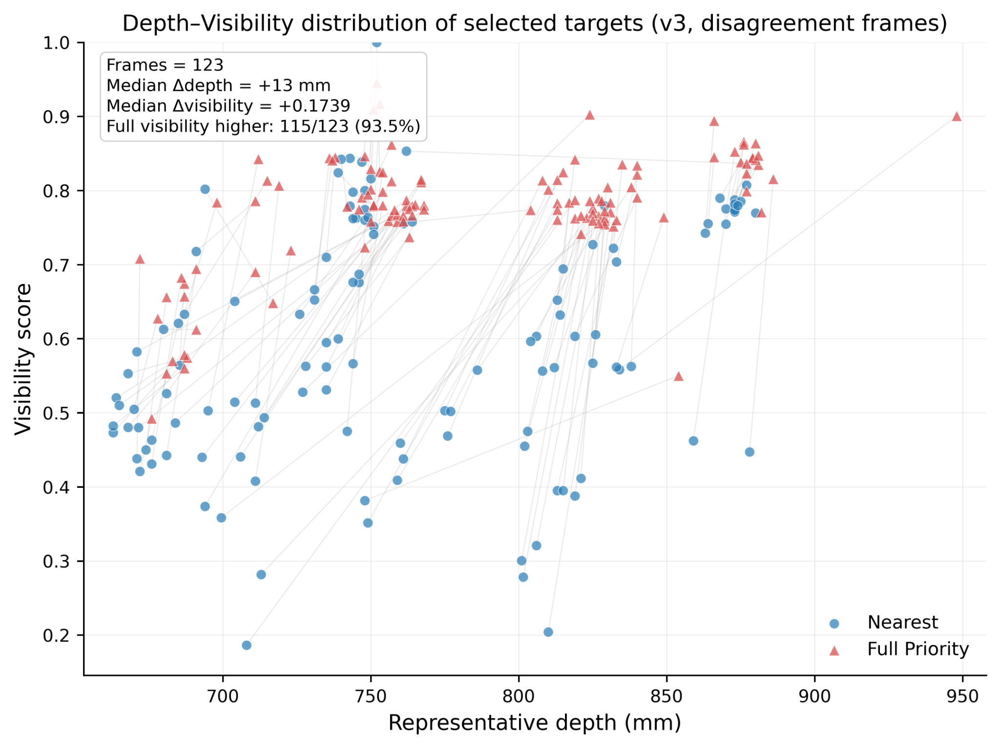

# 🏅 3D Position Estimation and Target Selection Algorithm Automated Harvesting of Fruiting Vegetables

주제 : 과채류의 3차원 위치 추정 및 수확 대상 선택 알고리즘 구현

* **저자 : 김동현, 정지성, 박민혁, 이규원, 이성재, 류병석, 김영균
* **ACK 2026 한국정보처리학회 학술대회논문집 33권 2호 ooo-ooo(0pages)**

본 연구는 온실의 여러 과실을 검출하고 3차원 위치를 추정한 뒤, 깊이 근접도·가시성 점수·검출 신뢰도·화면 중심 근접도를 결합하여 최우선 수확 대상을 선정한다. 깊이만 사용하는 기준 방법과 비교하여 **선정 결과가 얼마나 달라지고, 선택된 과실은 어떤 특성을 갖는지** 분석하였다.

---

## 📝 01. 연구 요약

온실에서는 여러 과실이 잎이나 인접 과실에 가려진 상태로 관찰된다. 과실을 검출하고 위치를 추정하는 것과, 여러 후보 중 어느 과실을 먼저 선택하는지는 구분되는 문제이다.

본 연구에서는 파프리카 RGB-D 데이터셋 **BUP-ST20**과 **YOLOv12n**을 이용하여 과실의 3차원 위치를 추정하고, 네 가지 선정 특성을 결합한 **우선순위 점수**를 구성하였다. 이를 **대표 깊이가 최소인 후보를 선택하는 깊이 단일 기준 방법**과 비교하였다.

| 분석 | 핵심 결과 | 해석 범위 |
|---|---|---|
| 3차원 위치 추정 | 거리 오차 중앙값 **8.7 mm**, RMSE **32.0 mm** | GT 마스크 기반 평가 기준 위치와의 차이 |
| V1 본 분석 | **103/364프레임(28.3%)**에서 선정 불일치 | 두 선정 방법이 다른 후보를 선택한 비율 |
| V1 선정 특성 | 불일치한 **103프레임 중 100프레임(97.1%)**에서 Full의 가시성 점수가 더 높음 | 선정이 달랐던 프레임 내부의 비교 |
| V3 보강 분석 | **123/364프레임(33.8%)**에서 선정 불일치 | 대표 깊이와 후보 조건을 변경한 보강 분석 |

**선정 불일치율은 정확도나 성능 향상률이 아니다.** 현재 결과는 선정 특성의 차이를 보여주며, 실제 수확 성공률·작업시간 또는 최적 수확 우선순위의 우열을 입증한 결과는 아니다.

---

## 📌 02. 연구 배경 및 문제 정의

### 위치 추정과 대상 선정

과채류 수확 자동화에서는 과실 인식·위치 추정뿐 아니라 수확할 대상을 결정하는 과정이 필요하다. 관련 연구에서는 과실의 인식과 위치 추정, 수확 작업의 순서 및 로봇 시스템의 현장 평가를 다루어 왔다[1–6].

| 구분 | 연구에서 다루는 질문 |
|---|---|
| **3차원 위치 추정** | 검출한 과실은 카메라 좌표계에서 어디에 있는가? |
| **대상 선정** | 같은 프레임의 여러 후보 중 어떤 과실을 최우선 대상으로 선택하는가? |

본 연구의 비교 기준은 **대표 깊이 하나만으로 대상을 선택하는 방법**이다. 이에 더해 가시성 점수, 검출 신뢰도, 화면 중심 근접도를 반영했을 때의 선택 변화를 분석한다.

> **연구 질문**  
> 깊이만으로 수확 대상을 선택할 때와 여러 선정 특성을 함께 고려할 때, 최우선 대상과 선택된 과실의 특성은 어떻게 달라지는가?

이에 답하기 위해 **구성요소별 비교**, **동일 프레임 내 선택값 차이 분석**, **가중치 민감도 분석**, **GT 마스크 기반 보강 분석**을 수행하였다.

---

## 📌 03. 데이터셋 구축 및 전처리

### 3.1 BUP-ST20

온실에서 수집된 파프리카 RGB-D 데이터셋 **BUP-ST20**을 사용하였다[7].

| 항목 | 내용 |
|---|---|
| 연구 대상 | 온실의 파프리카 |
| 깊이 취득 센서 | RealSense D435i |
| 영상 크기 | 가로 720 × 세로 1280 |
| 깊이 영상 | `uint16`, mm 단위 |
| 무효 깊이값 | `65535`를 깊이 계산에서 제외 |
| 과실별 라벨 | 경계 상자(B-box), 인스턴스 마스크(instance mask), 의미 라벨(semantic label) |
| 원본 세부 클래스 | Green, Red, Yellow, Mixed-red, Mixed-yellow |
| 학습에 사용한 클래스 | 단일 클래스 `pepper` |

색상별 세부 분류보다 **3차원 위치 추정 및 대상 선정 특성 분석**에 초점을 두어 다섯 클래스를 통합하였다. 따라서 색상·성숙도에 따른 수확 적합성 판정은 이번 분석 범위에 포함하지 않았다.

### 3.2 전처리와 분할

B-box 좌표를 영상의 유효 범위로 제한한 뒤 YOLO 형식의 정규화 좌표로 변환하였다. 객체 라벨이 없는 프레임도 제외하지 않고 기록하였으며, 프레임 식별자를 기준으로 RGB 영상·깊이 영상·라벨의 대응 관계를 확인하였다.

연속 프레임 간 유사성에 의한 데이터 누수를 줄이기 위해 **시퀀스 단위로 학습·검증·평가 구간을 분리**하였다.

| 구분 | 시퀀스 | 용도 |
|---|---|---|
| 학습 | 100–226 | 과실 검출 모델 학습 |
| 검증 | 300–371 | 학습 중 검증 및 가중치 선택 |
| 평가 | 400–475 | 검출 성능 평가 |
| 상세 분석 | 400–409 | 3차원 위치 오차 및 대상 선정 분석 |

상세 분석 구간에서 RGB 영상·깊이·라벨이 대응되는 **366프레임**을 위치 오차 평가에 사용하였다. 대상 선정 비교에는 이 중 **유효 후보가 2개 이상인 364프레임**을 사용하였다.

### 3.3 YOLOv12n 학습 조건

공유 연구 원고와 학습 담당자가 전달한 조건은 다음과 같다.

| 항목 | 설정 |
|---|---|
| 검출 모델 | YOLOv12n[9] |
| 학습 입력 크기 | 640 × 640 |
| 배치 크기 | 11 |
| 최적화 알고리즘 | MuSGD |
| 초기 학습률 | 0.01 |
| 실제 학습 횟수 | 100 epoch |
| 최종 가중치 선택 | 검증 mAP@0.5:0.95가 최대였던 14 epoch |

**검증 분할에서의 가중치 선택과 평가 분할에서의 검출 성능 보고는 구분한다.** 원본 실행 환경 파일과 상세 재현 절차는 코드 공개 단계에서 정리할 항목이다.

---

## 📌 04. 전체 알고리즘 및 우선순위 점수

### 4.1 전체 처리 흐름

위치 오차 평가와 대상 선정 분석은 **별도 평가 경로**이다. 위치 오차 평가의 결과를 입력으로 사용하여 대상을 선택하지 않는다. 또한 **예측 3차원 위치 자체의 계산에는 GT를 사용하지 않는다.**

### 4.2 대표 깊이와 3차원 위치 추정

원본 RGB 영상 좌표계로 변환한 예측 B-box 중심을 $(u,v)$로 사용한다. 중심 주변 **5×5 영역의 유효 깊이값 중앙값**을 대표 깊이 $Z$로 정하고, 카메라 내부 파라미터로 역투영한다.

$$
X=\frac{(u-c_x)Z}{f_x},\qquad
Y=\frac{(v-c_y)Z}{f_y},\qquad
P=(X,Y,Z)
$$

| 기호 | 의미 |
|---|---|
| $(u,v)$ | 예측 B-box 중심의 픽셀 좌표 |
| $(f_x,f_y)$ | 픽셀 단위의 초점거리 |
| $(c_x,c_y)$ | 영상의 주점 좌표 |
| $Z$ | 중심 주변 5×5 영역의 유효 깊이값 중앙값 |
| $P=(X,Y,Z)$ | 추정한 카메라 좌표계의 3차원 위치(mm) |

여기서 **대표 깊이 $Z$와 카메라 원점에서 과실까지의 3차원 직선거리는 다르다.** 본 연구의 깊이 단일 기준 방법은 대표 깊이가 최소인 후보를 선택한다.

### 4.3 우선순위 점수

깊이 근접도, 가시성 점수, 검출 신뢰도, 화면 중심 근접도를 $[0,1]$ 범위의 특성으로 사용하고, 가중합으로 우선순위 점수 $S$를 계산한다.

$$
S=w_1S_{\mathrm{prox}}+w_2S_{\mathrm{vis}}+
  w_3S_{\mathrm{conf}}+w_4S_{\mathrm{center}}
$$

| 비교 기호 | 특성 | 의미 | 대응 가중치 |
|---|---|---|---|
| D / $S_{\mathrm{prox}}$ | 깊이 근접도 | 대표 깊이가 작을수록 높은 점수 | $w_1=0.35$ |
| V / $S_{\mathrm{vis}}$ | 가시성 점수 | 마스크와 B-box의 면적비 기반 근사 지표 | $w_2=0.30$ |
| C / $S_{\mathrm{conf}}$ | 검출 신뢰도 | YOLOv12n의 검출 신뢰도 | $w_3=0.20$ |
| Ctr / $S_{\mathrm{center}}$ | 화면 중심 근접도 | 영상 중심에 가까울수록 높은 점수 | $w_4=0.15$ |

네 항목을 모두 사용하는 방법을 **전체 구성(Full)**이라 하며, 프레임 내에서 $S$가 최대인 후보를 **최우선 대상(Top-1)**으로 선택한다.

가중치는 수확 우선순위 정답으로 최적화한 값이 아니라 **비교를 위한 기준 설정값**이다. 가중치 설정에 따른 선택 변화는 민감도 분석에서 검토하였다.

### 4.4 가시성 점수와 GT 보조 정보

본 연구의 검출 모델은 B-box와 검출 신뢰도를 출력하며, 객체별 픽셀 영역인 인스턴스 마스크를 출력하지 않는다. 이에 예측 B-box와 GT B-box를 IoU 기준으로 대응시키고, 해당 GT 인스턴스 마스크를 가시성 점수 계산의 보조 정보로 사용하였다.

$$
S_{\mathrm{vis}}=\min\left(1,\frac{A_{\mathrm{GT\ mask}}}{A_{\mathrm{predicted\ bbox}}}\right)
$$

분자는 **대응된 GT 인스턴스 마스크의 면적**, 분모는 **예측 B-box의 면적**이다. 기존 코드에서는 분모의 최솟값을 1로 제한한다. 이 식은 마스크와 예측 B-box의 교집합 면적을 사용하는 계산과 구분된다.

이 값은 **점유율 기반 가시성 근사 지표**로, 실제 과실 전체 중 보이는 비율을 직접 측정한 값이 아니다. 따라서 높은 가시성 점수가 실제 파지 가능성이나 수확 성공을 보장하지 않는다.

---

## 📌 05. 평가 방법

평가는 **3차원 위치 오차**와 **대상 선정 특성의 비교**로 구성하였다.

### 5.1 위치 오차 평가

예측 B-box와 GT B-box를 **IoU 0.5 이상에서 높은 IoU 순으로 1:1 대응**하였다. 대응된 객체에 대해 다음 두 위치를 계산하였다.

| 구분 | 영상 내 기준점 | 깊이 |
|---|---|---|
| 예측 위치 $P$ | 예측 B-box 중심 | 중심 주변 5×5의 유효 깊이 중앙값 |
| 평가 기준 위치 $P_{\mathrm{ref}}$ | GT 인스턴스 마스크 무게중심 | GT 마스크 내부 유효 깊이 중앙값 |

두 경로는 **동일한 깊이 영상과 카메라 내부 파라미터**를 사용한다. 3차원 거리 오차는 다음과 같다.

$$
e_{\mathrm{3D}}=\left\|P-P_{\mathrm{ref}}\right\|_2
$$

이는 GT 마스크 기반 **평가 기준 위치와의 차이**이며, 독립적인 실측 파지 위치에 대한 절대 정확도가 아니다.

### 5.2 대상 선정 비교

V1에서는 신뢰도 조건을 충족하고 GT에 대응되며 유효한 중심 깊이를 확보한 공통 후보 집합에 두 선정 기준을 적용하였다.

| 방법 | 최우선 대상 선정 기준 |
|---|---|
| **깊이 단일 기준 방법** | 대표 깊이가 최소인 후보 |
| **전체 구성(Full)** | 네 선정 특성의 가중합 점수가 최대인 후보 |

보고한 지표는 **선정 불일치율**, **구성별 선정 일치율**, **선정 과실의 특성**, **동일 프레임 내 선택값 차이**이다. 실제 수확 우선순위 정답이 없으므로 이를 선정 정확도나 성능 우위로 해석하지 않는다.

| 평가 | 분석 규모 | 검출 신뢰도 임계값 |
|---|---|---:|
| 3차원 위치 오차 | 366프레임의 GT 대응·유효 깊이 확보 객체 2,959개 | 0.05 |
| V1 대상 선정 | 유효 후보 2개 이상인 364프레임 | 0.30 |
| V3 보강 분석 | 동일한 364프레임, 대표 깊이 및 후보 조건 변경 | 0.30 |

### 5.3 GT 사용 범위

| 단계 | GT 사용 여부와 역할 |
|---|---|
| 예측 3차원 위치 계산 | 사용하지 않음 |
| 3차원 위치 오차 평가 | 객체 대응 및 평가 기준 위치 산출 |
| V1 대상 선정 | 후보 대응 및 가시성 점수 산출 |
| V3 보강 분석 | 후보 대응·가시성 점수·대표 깊이 산출 |

대상 선정은 **GT 정보를 보조적으로 사용하는 GT-assisted 분석**이다. GT 마스크를 수확 우선순위의 정답으로 사용한 것은 아니다.

---

## 📊 06. 결과 ① 검출 및 3차원 위치 추정

### 6.1 과실 검출

평가 분할에서 보고한 YOLOv12n의 검출 성능은 다음과 같다.

| 지표 | 결과 |
|---|---:|
| mAP@0.5 | 0.785 |
| mAP@0.5:0.95 | 0.570 |
| 정밀도 | 0.870 |
| 재현율 | 0.702 |

### 6.2 3차원 위치 오차

검출 신뢰도 임계값 0.05에서 **GT에 대응되고 유효 깊이를 확보한 2,959개 객체**를 대상으로 평가하였다.

| 지표 | 결과 |
|---|---:|
| **3차원 거리 오차 중앙값** | **8.7 mm** |
| 3차원 거리 오차 RMSE | 32.0 mm |
| X축 RMSE | 7.5 mm |
| Y축 RMSE | 9.8 mm |
| Z축 RMSE | 29.5 mm |
| 3차원 거리 오차 20 mm 미만 | 81.8% |
| 3차원 거리 오차 50 mm 미만 | 94.9% |
| 최대 3차원 거리 오차 | 296.8 mm |

Z축 RMSE가 X·Y축보다 크게 나타났다. 최대 오차 사례의 추가 진단에서는 B-box 중심 표본에 가까운 전경 깊이가 포함된 정황을 확인하였다.

<strong>최대 오차 사례의 추가 진단</strong>

논문 수정 과정에서 수행한 추가 진단 요약이다. 최대 오차는 **시퀀스 406 / 프레임 1600938551417043**의 예측 #5, GT #4062837에서 보고되었다.

| 항목 | 진단 결과 |
|---|---|
| 검출 신뢰도 / IoU | 0.74955297 / 0.653050 |
| 중심 5×5의 유효 깊이 표본 | 25개 중 3개, 모두 685 mm |
| 유효 표본 중 대응 GT 마스크 내부 표본 | 0개 |
| 중심 5×5의 GT 마스크 포함 픽셀 | 1/25 |
| 예측 대표 깊이 | 685 mm |
| GT 마스크 내부 깊이 중앙값 | 959 mm |
| 깊이 차이(예측 − 기준) | −274 mm |
| X / Y / Z 오차 | +96.9 / −60.4 / −274.0 mm |
| 3차원 거리 오차 | 296.8 mm |

유효 깊이 표본이 모두 대응 과실의 GT 마스크 밖에 있었으며, 보고된 RGB 관찰에서는 과실을 가리는 잎 부근에 위치하였다. 수치와 영상 관찰은 **가까운 전경 깊이의 혼입**을 지지한다. 이 사례를 모든 큰 오차의 원인으로 일반화하지 않는다.

이 객체는 V1 후보에도 포함되었고 깊이 단일 기준 방법이 선택했으나 Full은 선택하지 않았다. 다만 상위 오차 10개 중 4개는 Full도 선택했으므로, **Full이 깊이 오차를 제거하거나 해결했다고 볼 수 없다.**

추가 진단에서 보고된 큰 오차의 규모는 다음과 같다. 세 조건은 서로 겹치는 누적 집계이다.

| 오차 조건 | 객체 수 / 전체 2,959개 | 비율 |
|---|---:|---:|
| 50 mm 초과 | 152 | 5.137% |
| 100 mm 초과 | 69 | 2.332% |
| 200 mm 초과 | 16 | 0.541% |

기존 평가 객체와 결과는 유지하였으며, 이 진단을 위해 큰 오차 객체를 제거하거나 필터링한 결과로 논문 수치를 대체하지 않았다.

<strong>검출 신뢰도 임계값에 따른 평가 대상 변화</strong>

| 지표 | 임계값 0.05 | 임계값 0.70 |
|---|---:|---:|
| GT와 대응되지 않은 예측 수 | 2,033 | 77 |
| 예측과 대응되지 않은 GT 수 | 472 | 1,288 |
| 3차원 거리 오차 중앙값 | 8.7 mm | 9.6 mm |

임계값이 높아지면 평가에 포함되는 예측·GT 대응 객체의 구성이 달라진다. 따라서 위 결과는 **같은 객체 집합에서 임계값만 바꾸어 오차가 개선됐는지 비교한 실험이 아니다.**

---

## 📊 07. 결과 ② 대상 선정 및 구성요소별 비교

### 7.1 전체 선정 결과

V1 본 분석의 **364프레임 중 103프레임(28.3%)**에서 전체 구성과 깊이 단일 기준 방법이 서로 다른 과실을 선택하였다.

### 7.2 구성요소별 비교

각 비교 구성에서는 활성화한 항목의 Full 가중치 비율을 유지하고, 합이 1이 되도록 재정규화하였다.

| 구성 | 가중치 D / V / C / Ctr | 깊이 단일 기준과 선정 불일치율 | Full과 선정 일치율 |
|---|---|---:|---:|
| D | 1.000 / 0 / 0 / 0 | 0.0% | 71.7% |
| D+V | 0.538 / 0.462 / 0 / 0 | 19.8% | 85.4% |
| D+V+C | 0.412 / 0.353 / 0.235 / 0 | 25.0% | 89.6% |
| **전체 구성(Full)** | **0.350 / 0.300 / 0.200 / 0.150** | **28.3%** | **100.0%** |
| 가시성 제외(Full−V) | 0.500 / 0 / 0.286 / 0.214 | 13.5% | 81.6% |

D+V는 깊이 단일 기준과 19.8% 다른 대상을 선택했으며, C와 Ctr을 포함한 구성에서는 각각 25.0%, 28.3%로 나타났다. Full에서 V를 제외하면 깊이 단일 기준과의 불일치율은 13.5%였고, Full과의 일치율은 81.6%였다.

**이 결과는 정의한 가시성 점수가 선정 차이에 관여함을 보여준다.** 다만 가시성 점수가 실제 가림 정도를 얼마나 정확히 나타내거나 수확 성과를 얼마나 개선하는지 검증한 것은 아니다.

> **비교 대상 구분**  
> **13.5%:** 가시성 제외 구성과 깊이 단일 기준 방법의 불일치율.  
> **81.6%:** 가시성 제외 구성과 Full의 일치율.  
> 두 비율은 비교하는 방법의 조합이 다르다.

---

## 📊 08. 결과 ③ 선정 과실의 특성 비교

### 8.1 V1 대표 사례

**시퀀스 402 / 프레임 `1600938539950348`**

  

그림 1. 깊이 단일 기준 방법과 Full의 선택 비교. 빨간 상자는 기준 방법, 파란 상자는 Full의 선택이다.

| 항목 | 깊이 단일 기준 방법 | 전체 구성(Full) |
|---|---:|---:|
| 선택 후보 | #4 | #1 |
| 대표 깊이 | 804 mm | 815 mm |
| 가시성 점수 | 0.556218 | 0.766013 |

**Full은 대표 깊이가 11 mm 더 큰 후보를 선택했으며, 가시성 점수는 0.209795 높았다.**

이 프레임은 선택 차이를 설명하기 위해 선별한 사례이다. 과실의 색상이나 성숙도를 평가해 선택한 결과가 아니며, 어느 과실이 실제 수확에 더 적합한지 입증하지 않는다. 전체 선정 경향은 아래의 103프레임 집계로 구분하여 제시한다.

<strong>대표 사례의 깊이 진단 정보</strong>

| 항목 | 깊이 단일 기준 선택 후보 | Full 선택 후보 |
|---|---:|---:|
| V1의 중심 5×5 대표 깊이 | 804 mm | 815 mm |
| 대응 GT 마스크 내부 깊이 중앙값 | 808 mm | 821 mm |
| 두 깊이 산출값의 절대 차이 | 4 mm | 6 mm |
| 예측 B-box 중심이 대응 GT 마스크 내부에 위치 | 예 | 예 |

GT 마스크 내부 깊이는 이 표에서 **진단용 비교값**이며, V1의 대표 깊이 계산을 대체하지 않는다. 두 깊이 산출값이 가깝다는 사실만으로 전경 혼입이 전혀 없거나 실제 거리 정확도가 보장된다고 해석하지 않는다.

### 8.2 선정이 달랐던 103프레임의 분포

  

그림 2. V1의 선정 불일치 103프레임. 원은 깊이 단일 기준, 삼각형은 Full을 나타낸다. 점이 겹칠 수 있으며 전체 분석 대상은 364프레임이다.

두 방법의 대표 깊이 분포는 상당 부분 중첩되지만, Full이 선택한 과실은 상대적으로 높은 가시성 점수 영역에 분포하였다.

### 8.3 방법별 중앙값과 프레임별 차이

먼저 각 방법이 선택한 과실 집단의 특성을 **중앙값 [제1사분위수, 제3사분위수]**로 정리하였다.

| 선정 특성 | 깊이 단일 기준 방법 | 전체 구성(Full) |
|---|---:|---:|
| 대표 깊이(mm) | 744 [706, 790] | 782 [748, 820] |
| 가시성 점수 | 0.507 [0.404, 0.671] | 0.786 [0.753, 0.833] |
| 검출 신뢰도 | 0.778 [0.627, 0.875] | 0.908 [0.863, 0.921] |
| 화면 중심 근접도 | 0.225 [0.189, 0.290] | 0.315 [0.230, 0.450] |

다음으로 **동일 프레임에서 Full이 선택한 과실의 값에서 깊이 단일 기준이 선택한 과실의 값을 뺀 차이**를 계산하였다.

| 프레임별 비교 | 결과 |
|---|---:|
| 대표 깊이 차이의 중앙값 | **+22 mm** |
| 가시성 점수 차이의 중앙값 | **+0.242** |
| Full의 가시성 점수가 더 높은 프레임 | **100/103(97.1%)** |

> **두 종류의 중앙값을 혼동하지 않는다.**  
> 방법별 대표 깊이 중앙값의 차이는 $782-744=38$ mm이지만, 같은 프레임의 차이를 먼저 계산한 후 그 차이들의 중앙값을 구하면 **22 mm**이다. 가시성 점수도 같은 방식으로 구분한다.

집계 수치는 논문의 보고값을, 대표 사례 수치는 개별 결과의 출력 정밀도를 따른다.

---

## 📊 09. 결과 ④ 가중치 민감도 및 보강 분석

### 9.1 가시성 가중치 민감도

가시성 가중치를 0.00–0.60으로 변화시켰다. 나머지 D:C:Ctr의 가중치 비율은 유지하고 전체 가중치 합이 1이 되도록 조정하였다.

| 가시성 가중치 | 깊이 단일 기준과 선정 불일치율 |
|---:|---:|
| 0.00 | 13.5% |
| 0.10 | 16.5% |
| 0.20 | 19.8% |
| **0.30 — 기준 설정** | **28.3%** |
| 0.40 | 38.2% |
| 0.50 | 46.4% |
| 0.60 | 53.0% |

관찰한 구간에서 불일치율이 단조 증가하였다. 이는 **가시성 점수의 상대적 비중에 따라 선정 결과가 달라짐**을 나타낸다. 가중치를 높일수록 성능이 개선되거나 기준 가중치 0.30이 최적이라는 의미는 아니다.

### 9.2 V3 보강 분석의 목적

B-box 중심 주변의 깊이에 전경 잎의 깊이값이 포함될 수 있어, 대응된 **GT 인스턴스 마스크 내부 유효 깊이 중앙값**을 사용하는 보강 분석을 수행하였다.

| 조건 | V1 본 분석 | V3 보강 분석 |
|---|---|---|
| 대표 깊이 | 예측 B-box 중심 5×5 유효 깊이 중앙값 | 대응 GT 마스크 내부 유효 깊이 중앙값 |
| 중심 5×5 깊이 유효성 조건 | 후보 구성에 적용 | 후보 구성에서 제외 |
| 분석 프레임 | 364 | 364 |
| 가시성 계산 | GT 마스크 기반 근사 지표 | GT 마스크 기반 근사 지표 |
| 분석의 성격 | 본 분석 | GT 보조 정보를 사용하는 보강 분석 |

**V3는 대표 깊이뿐 아니라 후보 구성 조건도 변경한 분석이다.** 같은 프레임을 분석하더라도 후보 집합은 달라질 수 있으므로, V1과의 차이를 대표 깊이 변경 하나의 효과로만 해석하지 않는다.

### 9.3 V3 결과

| 지표 | V1 본 분석 | V3 보강 분석 |
|---|---:|---:|
| 깊이 단일 기준과 선정 불일치 | **103/364(28.3%)** | **123/364(33.8%)** |
| 불일치 프레임 중 Full의 가시성 점수가 더 높은 경우 | 100/103(97.1%) | 115/123(93.5%) |
| 프레임별 대표 깊이 차이의 중앙값 | +22 mm | +13.0 mm |
| 프레임별 가시성 점수 차이의 중앙값 | +0.242 | +0.1739 |

차이의 중앙값은 **각 분석에서 선정이 달랐던 프레임**을 대상으로 한 결과다. 보강 조건에서도 Full이 상대적으로 높은 가시성 점수의 과실을 선택하는 경향이 관찰되었다.

<strong>V3 분포 및 분석 버전 구분</strong>

  

그림 3. V3 선정 불일치 123프레임의 기존 결과 그림. 이 그림에서는 파란 원이 깊이 단일 기준, 빨간 삼각형이 Full이다. V1 그림과 색 배치가 다르므로 범례를 기준으로 읽는다.

V1의 **103프레임**, 중간 GT 마스크 분석의 **118프레임**, V3의 **123프레임**은 서로 다른 분석 결과다. 현재 본 분석은 V1, 보강 분석은 V3이며 중간 분석을 둘 중 하나의 결과로 대체하지 않는다.

기존 기록에서는 V1이 단일 최소 깊이 후보를 선택하고, V3는 최소 깊이가 같은 후보 집합을 고려하는 동률 처리 방식을 명시한다. 위 수치는 각 분석 기록의 보고값으로, 모든 세부 조건을 동일하게 다시 집계한 결과가 아니다.

**V3는 실제 수확 성능이 V1보다 우수함을 입증하거나 최대 위치 오차를 해결한 실험이 아니다.** 대표 깊이 산출 및 후보 조건을 바꿨을 때의 선정 경향을 검토한 결과다.

---

## 📝 10. 결론

본 연구에서는 **YOLOv12n 기반 과실 검출, RGB-D 기반 3차원 위치 추정, 다기준 우선순위 점수 기반 대상 선정**을 하나의 처리 체계로 구성하였다.

GT 마스크 기반 평가 기준 위치와의 3차원 거리 오차 중앙값은 **8.7 mm**였다. 대상 선정에서는 깊이 단일 기준과 Full이 **28.3%의 프레임에서 다른 후보**를 선택하였고, 구성요소별 비교와 민감도 분석에서 가시성 점수의 반영에 따른 선택 변화를 확인하였다. GT 마스크 기반 보강 분석에서도 상대적으로 높은 가시성 점수의 후보를 선택하는 경향이 나타났다.

연구의 기여는 **다기준 점수가 깊이 단일 기준과 어떤 다른 선택을 만드는지, 그 선택에 어떤 특성 간 차이가 수반되는지 정량화한 것**이다.

---

## 🔍 11. 한계 및 향후 연구

| 한계 | 현재 결과의 해석 범위 |
|---|---|
| **GT 의존성** | 후보 대응과 가시성 계산에 GT를 사용하며, V3는 대표 깊이 계산에도 GT 마스크를 사용한다. |
| **가시성 근사 지표** | 마스크와 B-box의 면적비이며, 실제 가시율·가림 정도의 측정 정확도는 검증하지 않았다. |
| **위치 평가 기준** | 예측 위치와 기준 위치가 동일한 깊이 영상을 사용하므로 실제 파지 정확도와 구분해야 한다. |
| **평가 범위** | 위치·선정 상세 분석은 BUP-ST20의 시퀀스 400–409에 한정된다. 다른 작물·센서·환경으로의 일반화는 별도 검증이 필요하다. |
| **실제 작업 성과** | 성숙도별 수확 적합성, 실제 파지 성공률, 작업시간 및 정답 우선순위에 따른 우열은 평가하지 않았다. |
| **가중치 설정** | 최적값을 학습한 것이 아니라 기준 가중치와 그 주변의 선택 변화를 분석하였다. |

향후에는 **예측 인스턴스 마스크를 이용한 대표 깊이·가시성 근사 지표 산출**과 **GT 대응에 의존하지 않는 후보 구성**을 검토할 필요가 있다. 이와 함께 실제 파지 성공률과 독립적인 수확 대상 선정 기준을 이용해 점수와 작업 성과의 관계를 검증해야 한다.

---

## 📄 12. 논문 정보 및 참고문헌

### 논문 정보

**한글 제목:** 과채류 자동 수확을 위한 3D 위치 추정 및 대상 선정 알고리즘  
**영문 제목:** 3D Position Estimation and Target Selection Algorithm for Automated Harvesting of Fruiting Vegetables  
**저자:** 김동현, 정지성, 박민혁, 이규원, 류병석, 김영균  
**관련 학술대회:** ACK 2026 · 한국정보처리학회

권·호·페이지·공식 논문 링크는 확정된 정보를 확인한 뒤 추가한다.

### 주요 참고문헌

아래는 공유 연구 원고에 기재된 참고문헌이다.

[1] A. Silwal, J. R. Davidson, M. Karkee, C. Mo, Q. Zhang, and K. Lewis, “Design, integration, and field evaluation of a robotic apple harvester,” *Journal of Field Robotics*, 34(6), 1140–1159, 2017.

[2] Y. Yang, Y. Han, S. Li, Y. Yang, M. Zhang, and H. Li, “Vision based fruit recognition and positioning technology for harvesting robots,” *Computers and Electronics in Agriculture*, 213, 108258, 2023.

[3] S. Hayashi, K. Shigematsu, S. Yamamoto, K. Kobayashi, Y. Kohno, J. Kamata, and M. Kurita, “Evaluation of a strawberry-harvesting robot in a field test,” *Biosystems Engineering*, 105(2), 160–171, 2010.

[4] Y. Ge, Y. Xiong, and P. J. From, “Symmetry-based 3D shape completion for fruit localisation for harvesting robots,” *Biosystems Engineering*, 197, 188–202, 2020.

[5] P. Kurtser and Y. Edan, “Planning the sequence of tasks for harvesting robots,” *Robotics and Autonomous Systems*, 131, 103591, 2020.

[6] B. Arad, J. Balendonck, R. Barth, O. Ben-Shahar, Y. Edan, T. Hellström, J. Hemming, P. Kurtser, O. Ringdahl, T. Tielen, and B. van Tuijl, “Development of a sweet pepper harvesting robot,” *Journal of Field Robotics*, 37(6), 1027–1039, 2020.

[7] E. Guclu, M. Halstead, S. Denman, and C. McCool, “Weakly labelled spatial-temporal sweet pepper data: Enabling higher quality detection, segmentation, and tracking,” *The International Journal of Robotics Research*, 45(7), 983–1004, 2026.

[8] Y. Tian, G. Yang, Z. Wang, H. Wang, E. Li, and Z. Liang, “Apple detection during different growth stages in orchards using the improved YOLO-V3 model,” *Computers and Electronics in Agriculture*, 157, 417–426, 2019.

[9] Y. Tian, Q. Ye, and D. Doermann, “YOLOv12: Attention-Centric Real-Time Object Detectors,” arXiv:2502.12524, 2025.

